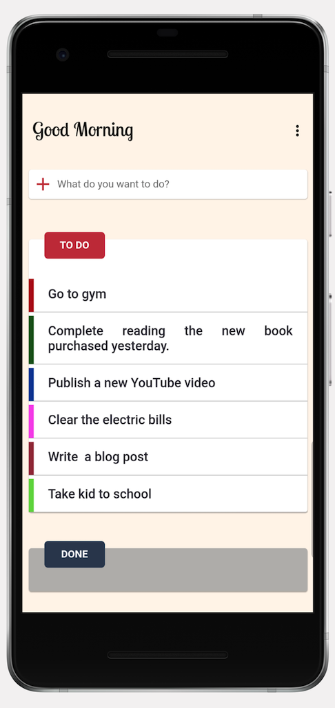
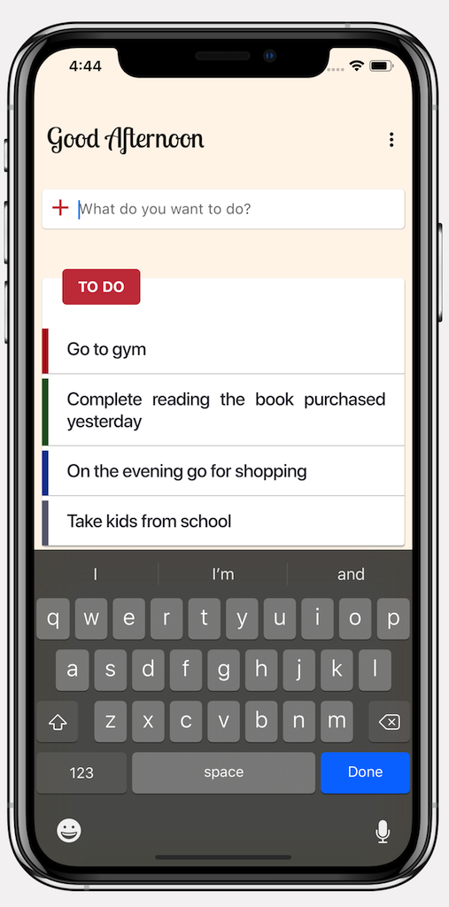

    
    
    
    

# Flutter Todos

> A cross platform todo list app using flutter and dart programming language. In this application, I used SQLite3 to persist data. The app works in both iOS and Android operating system. 

    
    
     

## Code Discussion
[Video Presentation](https://www.youtube.com/watch?v=OQG3MxenJsM)

## Roadmap
- [x] SQLite integration

# Demo
- 
- [My Other Mobile Apps](https://ithinkdiff.net)
- [A Todos Application by React Native](https://github.com/mahmudahsan/todos-react-reactnative)
-  [Flutter and Dart Tutorials](https://www.youtube.com/playlist?list=PLlMOodDAsO4xrTgVEkKXfVf7sSVEsmWKQ)

### Widgets

>  [Widget Index](https://flutter.dev/docs/reference/widgets)

- [MaterialApp](https://api.flutter.dev/flutter/material/MaterialApp-class.html)
- [Scaffold](https://api.flutter.dev/flutter/material/Scaffold-class.html)
- [Container](https://api.flutter.dev/flutter/widgets/Container-class.html)
- [Column](https://api.flutter.dev/flutter/widgets/Column-class.html)
- [Row](https://api.flutter.dev/flutter/widgets/Row-class.html)
- [Expanded](https://api.flutter.dev/flutter/widgets/Expanded-class.html)
- [LimitedBox](https://api.flutter.dev/flutter/widgets/LimitedBox-class.html)
- [IntrinsicHeight](https://api.flutter.dev/flutter/widgets/IntrinsicHeight-class.html)
- [InkWell](https://api.flutter.dev/flutter/material/InkWell-class.html)

### Flutter Full Application
1. [Vote](https://git.io/JeRjb) | [Tutorial](https://www.youtube.com/watch?v=Iu9DpbzR83s&list=PLlMOodDAsO4zQ243zMHKKrV316PJU9q0E&index=2&t=0s)
2. [Todos](https://github.com/mahmudahsan/flutter_todos) | [Tutorial](https://youtu.be/OQG3MxenJsM)

### Flutter Tutorials Beginners
1. [Dart Programming Language for Beginners](https://www.youtube.com/watch?v=Ej_Pcr4uC2Q&list=PLlMOodDAsO4xrTgVEkKXfVf7sSVEsmWKQ&index=2&t=10s)
2. [Flutter for Beginners - Creating First App](https://www.youtube.com/watch?v=HFl29MoZ6MA&list=PLlMOodDAsO4xrTgVEkKXfVf7sSVEsmWKQ&index=3&t=0s)
3. [How to Create a Profile Page App](https://www.youtube.com/watch?v=ULxYR66BRb4&list=PLlMOodDAsO4xrTgVEkKXfVf7sSVEsmWKQ&index=5&t=0s)

### Intermediate Dart Knowledge
1. [What is Future and Async](https://www.youtube.com/watch?v=8KOdOXRboh8&list=PLlMOodDAsO4xrTgVEkKXfVf7sSVEsmWKQ&index=12&t=0s)

### More Tutorials / Links
- [Flutter by Mahmud Ahsan](https://github.com/mahmudahsan/flutter)

### Resources

- [Official Site](https://flutter.dev/)
- [Widget Category](https://flutter.dev/docs/reference/widgets)
- [Pub.Dev](https://pub.dev/)

## Questions or feedback?

Feel free to open an issue, or find me [@mahmudahsan on Twitter](https://twitter.com/mahmudahsan).
